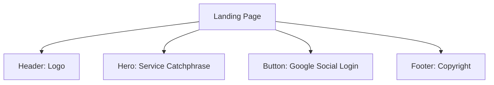
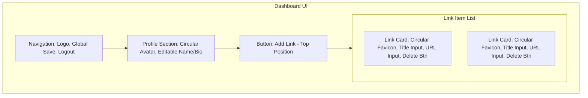
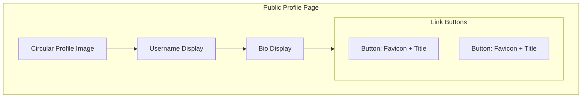

# 마이링크 (MyLink) 와이어프레임

본 문서는 마이링크 서비스의 UI 구조를 시각화한 와이어프레임입니다.

## 1. 서비스 랜딩 페이지 (로그인 전)

방문자가 처음 접속했을 때 보게 되는 화면입니다.

### 1.1 ASCII 구조
```text
+------------------------------------------+
|  MyLink ロゴ                             |
+------------------------------------------+
|                                          |
|         나만의 모든 링크를               |
|         하나의 페이지로.                 |
|                                          |
|         [ 구글로 시작하기 ]              |
|                                          |
+------------------------------------------+
|  © 2026 MyLink                           |
+------------------------------------------+
```

### 1.2 Mermaid 다이어그램


---

## 2. 대시보드 (소유자 편집 페이지)

로그인 후 링크를 관리하는 화면입니다.

### 2.1 ASCII 구조
```text
+------------------------------------------+
| MyLink (Logo)          [저장]  [로그아웃] |
+------------------------------------------+
|                                          |
|      +----------+                        |
|      |  (IMG)   | <--- 원형 프로필       |
|      +----------+                        |
|      [ username ]  <--- 인라인 수정      |
|      [   bio    ]  <--- 인라인 수정      |
|                                          |
+------------------------------------------+
|         [ + 새 링크 추가 ]               | <--- 최상단 배치
+------------------------------------------+
|                                          |
|  +------------------------------------+  |
|  | ( ) [ 제목 ]                       |  | <--- 원형 아이콘(파비콘)
|  |     [ URL  ]               [삭제]  |  |
|  +------------------------------------+  |
|                                          |
|  +------------------------------------+  |
|  | ( ) [ 제목 ]                       |  |
|  |     [ URL  ]               [삭제]  |  |
|  +------------------------------------+  |
|                                          |
+------------------------------------------+
```

### 2.2 Mermaid 다이어그램


---

## 3. 프로필 페이지 (공개 방문자용)

다른 사용자가 `mylink.com/{displayName}`으로 접속했을 때 보는 화면입니다.

### 3.1 ASCII 구조
```text
+------------------------------------------+
|                                          |
|               ( PROFIL )                 |
|                                          |
|                username                  |
|                   bio                    |
|                                          |
|      +----------------------------+      |
|      | ( )       Link 1           |      |
|      +----------------------------+      |
|                                          |
|      +----------------------------+      |
|      | ( )       Link 2           |      |
|      +----------------------------+      |
|                                          |
+------------------------------------------+
```

### 3.2 Mermaid 다이어그램


---

## 4. UI/UX 상세 가이드라인

1.  **원형 아이콘**: 모든 프로필 이미지와 링크 파비콘은 원형(`border-radius: 50%`)으로 처리하여 부드러운 인상을 줍니다.
2.  **저장 버튼**: 우측 상단 내비게이션 바에 고정(Sticky) 배치하여 언제든 변경 사항을 저장할 수 있도록 합니다.
3.  **최상단 추가 버튼**: 리스트의 최상단에 큰 버튼으로 배치하여 새로운 링크 등록을 가장 먼저 유도합니다.
4.  **인라인 편집**: 텍스트 영역 클릭 시 바로 `input` 혹은 `textarea`로 전환되며, 최종 저장은 상단 '저장' 버튼을 통해 수행합니다.
